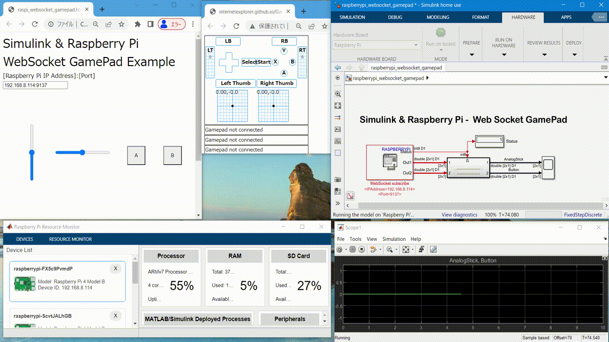

# SimulinkRaspiWebSocketGamePad
Web-based GamPad example using WebSocket+P5js.

## Requires
### MATLAB/Simulink
- MATLAB 2019B or later
- Simulink
### MATLAB Add on Package
- Simulink Support Package for Raspberry Pi Hardware
### Hardware
- Raspberry Pi ([Supported Hardware](https://jp.mathworks.com/hardware-support/raspberry-pi-simulink.html))
- Game Pad Device for HostPC
### Reference
- p5.js Javascript library (https://p5js.org/)
